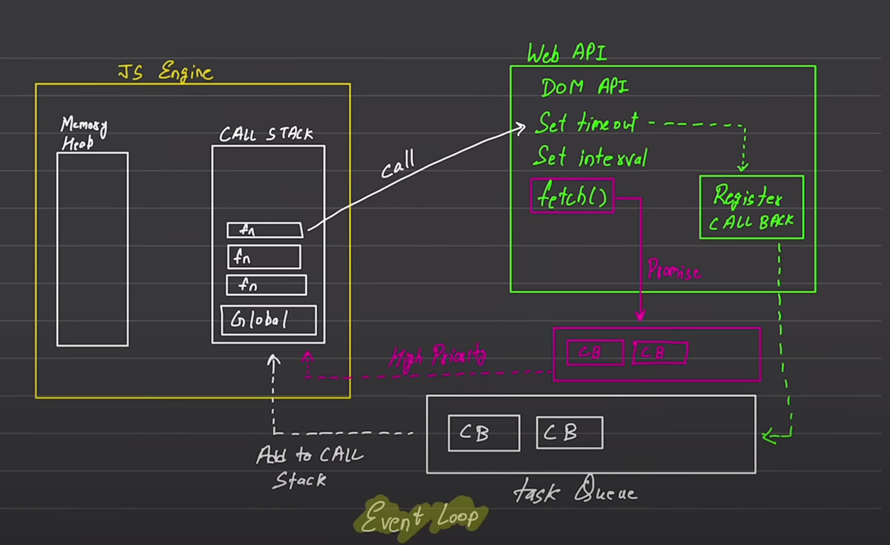

# Asynchronous JavaScript
## default JavaScript
Javascript is synchronous and single-threaded. This means that it has only one call stack and one memory heap.
each opration waits for the previous one to complete, and the stack is a LIFO (Last In, First Out) structure.

| Blocking Code | Non-Blocking Code |
|---------------|------------------|
| Executes sequentially, one operation at a time. | Executes concurrently, allowing multiple operations to run simultaneously. |
| Each operation must complete before the next one can start. | Operations can start without waiting for the previous ones to complete. |
| Can cause the program to freeze or become unresponsive if an operation takes a long time. | Does not block the execution of other operations, even if one operation takes a long time. |
| Commonly used in synchronous programming models. | Commonly used in asynchronous programming models. |

## Asynchronous JavaScript
Asynchronous JavaScript is a form of programming in which a function runs not only when it is called, but also when a specific event occurs. This is made possible by the use of callbacks, which are functions that are called when an event occurs.